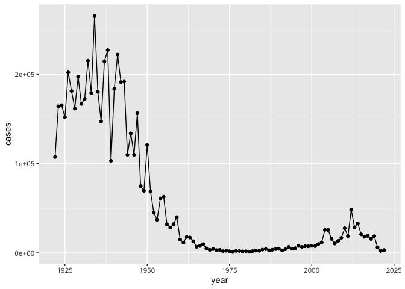

# BIMM143 Lab15 - Mini Project: Investigating Pertussis Resurgence
Sofia Lanaspa, A17105313

# Mini Project: Investigating Pertussis Resurgence

## Background

Pertussis (a.k.a. whooping cough) is a highly contagious respiratory
disease caused by the bacterium *Bordetella pertussis* - hard to treat
since it is hard to tell apart from common cold if treated early on with
antibiotics development can be stopped and cured - leads to death in
infants, continuous cough in adults (broken ribs and more)

VACCINES - whole-cell (wP) vaccine : 1st vaccine used inactive form of
the bacteria - acellular (aP) vaccine: less immune reaction but still
has pertussis toxin, cleaned up version of wP vaccine

!!! Tens of thousands this week, on the rise again, WHY? !!!

The CDC tracks pertussis cases per year. Lets have a closer look at this
data:

[CDC
data](https://www.cdc.gov/pertussis/php/surveillance/pertussis-cases-by-year.html?CDC_AAref_Val=https://www.cdc.gov/pertussis/surv-reporting/cases-by-year.html)

We will use the **datapasta** R package to ‘scrape’ this data into R.

#### Question 1

Q1. With the help of the R “addin” package datapasta assign the CDC
pertussis case number data to a data frame called cdc and use ggplot to
make a plot of cases numbers over time.

``` r
#install.packages("datapasta")  in R console
library(datapasta)
# datapasta in 'addins' at the top of R, copy data and then select paste and data.frame
cdc <- data.frame(
                                 year = c(1922L,1923L,1924L,1925L,
                                          1926L,1927L,1928L,1929L,1930L,1931L,
                                          1932L,1933L,1934L,1935L,1936L,
                                          1937L,1938L,1939L,1940L,1941L,1942L,
                                          1943L,1944L,1945L,1946L,1947L,
                                          1948L,1949L,1950L,1951L,1952L,
                                          1953L,1954L,1955L,1956L,1957L,1958L,
                                          1959L,1960L,1961L,1962L,1963L,
                                          1964L,1965L,1966L,1967L,1968L,1969L,
                                          1970L,1971L,1972L,1973L,1974L,
                                          1975L,1976L,1977L,1978L,1979L,1980L,
                                          1981L,1982L,1983L,1984L,1985L,
                                          1986L,1987L,1988L,1989L,1990L,
                                          1991L,1992L,1993L,1994L,1995L,1996L,
                                          1997L,1998L,1999L,2000L,2001L,
                                          2002L,2003L,2004L,2005L,2006L,2007L,
                                          2008L,2009L,2010L,2011L,2012L,
                                          2013L,2014L,2015L,2016L,2017L,2018L,
                                          2019L,2020L,2021L,2022L),
         cases = c(107473,164191,165418,152003,
                                          202210,181411,161799,197371,
                                          166914,172559,215343,179135,265269,
                                          180518,147237,214652,227319,103188,
                                          183866,222202,191383,191890,109873,
                                          133792,109860,156517,74715,69479,
                                          120718,68687,45030,37129,60886,
                                          62786,31732,28295,32148,40005,
                                          14809,11468,17749,17135,13005,6799,
                                          7717,9718,4810,3285,4249,3036,
                                          3287,1759,2402,1738,1010,2177,2063,
                                          1623,1730,1248,1895,2463,2276,
                                          3589,4195,2823,3450,4157,4570,
                                          2719,4083,6586,4617,5137,7796,6564,
                                          7405,7298,7867,7580,9771,11647,
                                          25827,25616,15632,10454,13278,
                                          16858,27550,18719,48277,28639,32971,
                                          20762,17972,18975,15609,18617,
                                          6124,2116,3044)
       )

# you can install and run package 'styler' to edit format
```

``` r
cdc
```

        year  cases
    1   1922 107473
    2   1923 164191
    3   1924 165418
    4   1925 152003
    5   1926 202210
    6   1927 181411
    7   1928 161799
    8   1929 197371
    9   1930 166914
    10  1931 172559
    11  1932 215343
    12  1933 179135
    13  1934 265269
    14  1935 180518
    15  1936 147237
    16  1937 214652
    17  1938 227319
    18  1939 103188
    19  1940 183866
    20  1941 222202
    21  1942 191383
    22  1943 191890
    23  1944 109873
    24  1945 133792
    25  1946 109860
    26  1947 156517
    27  1948  74715
    28  1949  69479
    29  1950 120718
    30  1951  68687
    31  1952  45030
    32  1953  37129
    33  1954  60886
    34  1955  62786
    35  1956  31732
    36  1957  28295
    37  1958  32148
    38  1959  40005
    39  1960  14809
    40  1961  11468
    41  1962  17749
    42  1963  17135
    43  1964  13005
    44  1965   6799
    45  1966   7717
    46  1967   9718
    47  1968   4810
    48  1969   3285
    49  1970   4249
    50  1971   3036
    51  1972   3287
    52  1973   1759
    53  1974   2402
    54  1975   1738
    55  1976   1010
    56  1977   2177
    57  1978   2063
    58  1979   1623
    59  1980   1730
    60  1981   1248
    61  1982   1895
    62  1983   2463
    63  1984   2276
    64  1985   3589
    65  1986   4195
    66  1987   2823
    67  1988   3450
    68  1989   4157
    69  1990   4570
    70  1991   2719
    71  1992   4083
    72  1993   6586
    73  1994   4617
    74  1995   5137
    75  1996   7796
    76  1997   6564
    77  1998   7405
    78  1999   7298
    79  2000   7867
    80  2001   7580
    81  2002   9771
    82  2003  11647
    83  2004  25827
    84  2005  25616
    85  2006  15632
    86  2007  10454
    87  2008  13278
    88  2009  16858
    89  2010  27550
    90  2011  18719
    91  2012  48277
    92  2013  28639
    93  2014  32971
    94  2015  20762
    95  2016  17972
    96  2017  18975
    97  2018  15609
    98  2019  18617
    99  2020   6124
    100 2021   2116
    101 2022   3044

``` r
library(ggplot2)
baseplot <- ggplot(cdc,aes(year,cases)) + geom_point() + geom_line()
baseplot
```



#### Question 2

Q2. Using the ggplot geom_vline() function add lines to your previous
plot for the 1946 introduction of the wP vaccine and the 1996 switch to
aP vaccine (see example in the hint below). What do you notice?

``` r
?geom_vline()
baseplot + geom_vline(xintercept=1946, color="purple") + geom_vline(xintercept=1996,color="pink") + geom_vline(xintercept=2020,color="lightgreen") + geom_vline(xintercept=2003,color="orange")
```


We went from ~200,000 cases pre wP vaccine (purple) to very few cases in
1976 (1010 cases). The US switched to the aP vaccine (pink) in 1995. We
start to see a large increase in 2004 to ~26,000 cases (orange)

#### Question 3

Q3. Describe what happened after the introduction of the aP vaccine? Do
you have a possible explanation for the observed trend?

``` r
# After the introduction of the aP vaccine the cases began to increase again, maybe this vaccine does not actually provide full immunity to the bacteria, or the bacteria could have evolved (but generally pretty stable)
```

**KEY QUESTION**: Why does the aP vaccine induced immunity wane faster
than that of the wP vaccine?

## CMI-PB

The CMI-PB (Computational Models of Immunity Pertussis Boost) makes
available lots of data about the immune response to Pertussis booster
vaccination.

Critically, it tracks wP and aP individuals over time to see how their
immune response changes.

CMI-PB make all their data freely available via JSON format tables from
their databases. *JSON instead of CSV so download data differently*

``` r
library(jsonlite)

subject <- read_json("http://cmi-pb.org/api/v5/subject", simplifyVector = T)
head (subject)
```

      subject_id infancy_vac biological_sex              ethnicity  race
    1          1          wP         Female Not Hispanic or Latino White
    2          2          wP         Female Not Hispanic or Latino White
    3          3          wP         Female                Unknown White
    4          4          wP           Male Not Hispanic or Latino Asian
    5          5          wP           Male Not Hispanic or Latino Asian
    6          6          wP         Female Not Hispanic or Latino White
      year_of_birth date_of_boost      dataset
    1    1986-01-01    2016-09-12 2020_dataset
    2    1968-01-01    2019-01-28 2020_dataset
    3    1983-01-01    2016-10-10 2020_dataset
    4    1988-01-01    2016-08-29 2020_dataset
    5    1991-01-01    2016-08-29 2020_dataset
    6    1988-01-01    2016-10-10 2020_dataset

``` r
nrow(subject) # number of individuals
```

    [1] 172

#### Question 4

Q4. How many aP and wP infancy vaccinated subjects are in the dataset?

``` r
table(subject$infancy_vac)
```


    aP wP 
    87 85 

#### Question 5

Q5. How many Male and Female subjects/patients are in the dataset?

``` r
table(subject$biological_sex)
```


    Female   Male 
       112     60 

#### Question 6

Q6. What is the breakdown of race and biological sex (e.g. number of
Asian females, White males etc…)?

``` r
table(subject$race, subject$biological_sex)
```

                                               
                                                Female Male
      American Indian/Alaska Native                  0    1
      Asian                                         32   12
      Black or African American                      2    3
      More Than One Race                            15    4
      Native Hawaiian or Other Pacific Islander      1    1
      Unknown or Not Reported                       14    7
      White                                         48   32

Q. Does this do a good job of representing the US populous? **NO way**
Patients are only those who were willing to go to the hospital to get
these tests done.

Let’s get more data from CMI-PB, this time about the specimens collected

``` r
specimen <- read_json("http://cmi-pb.org/api/v5/specimen", simplifyVector = T)

head(specimen)
```

      specimen_id subject_id actual_day_relative_to_boost
    1           1          1                           -3
    2           2          1                            1
    3           3          1                            3
    4           4          1                            7
    5           5          1                           11
    6           6          1                           32
      planned_day_relative_to_boost specimen_type visit
    1                             0         Blood     1
    2                             1         Blood     2
    3                             3         Blood     3
    4                             7         Blood     4
    5                            14         Blood     5
    6                            30         Blood     6

MAKE ONE META TABLE We can join (merge) these two tables ‘subject’ and
‘specimen’ to make one new ‘meta’ table with the combined data using
“inner_join()”

``` r
library(dplyr)
```


    Attaching package: 'dplyr'

    The following objects are masked from 'package:stats':

        filter, lag

    The following objects are masked from 'package:base':

        intersect, setdiff, setequal, union

``` r
meta <- inner_join(subject,specimen)
```

    Joining with `by = join_by(subject_id)`

``` r
head(meta)
```

      subject_id infancy_vac biological_sex              ethnicity  race
    1          1          wP         Female Not Hispanic or Latino White
    2          1          wP         Female Not Hispanic or Latino White
    3          1          wP         Female Not Hispanic or Latino White
    4          1          wP         Female Not Hispanic or Latino White
    5          1          wP         Female Not Hispanic or Latino White
    6          1          wP         Female Not Hispanic or Latino White
      year_of_birth date_of_boost      dataset specimen_id
    1    1986-01-01    2016-09-12 2020_dataset           1
    2    1986-01-01    2016-09-12 2020_dataset           2
    3    1986-01-01    2016-09-12 2020_dataset           3
    4    1986-01-01    2016-09-12 2020_dataset           4
    5    1986-01-01    2016-09-12 2020_dataset           5
    6    1986-01-01    2016-09-12 2020_dataset           6
      actual_day_relative_to_boost planned_day_relative_to_boost specimen_type
    1                           -3                             0         Blood
    2                            1                             1         Blood
    3                            3                             3         Blood
    4                            7                             7         Blood
    5                           11                            14         Blood
    6                           32                            30         Blood
      visit
    1     1
    2     2
    3     3
    4     4
    5     5
    6     6

Now read an ’experiment data table from CMI-PB Antibody titter levels:

``` r
abdata <- read_json("http://cmi-pb.org/api/v5/plasma_ab_titer", simplifyVector = T)
head(abdata)
```

      specimen_id isotype is_antigen_specific antigen        MFI MFI_normalised
    1           1     IgE               FALSE   Total 1110.21154       2.493425
    2           1     IgE               FALSE   Total 2708.91616       2.493425
    3           1     IgG                TRUE      PT   68.56614       3.736992
    4           1     IgG                TRUE     PRN  332.12718       2.602350
    5           1     IgG                TRUE     FHA 1887.12263      34.050956
    6           1     IgE                TRUE     ACT    0.10000       1.000000
       unit lower_limit_of_detection
    1 UG/ML                 2.096133
    2 IU/ML                29.170000
    3 IU/ML                 0.530000
    4 IU/ML                 6.205949
    5 IU/ML                 4.679535
    6 IU/ML                 2.816431

One more join to do of ‘meta’ and ‘abdata’ to associate all the metadata
about the individual and their race, biological sex and infancy
vaccination status together with antibody levels…

``` r
ab <- inner_join(abdata, meta)
```

    Joining with `by = join_by(specimen_id)`

``` r
head(ab)
```

      specimen_id isotype is_antigen_specific antigen        MFI MFI_normalised
    1           1     IgE               FALSE   Total 1110.21154       2.493425
    2           1     IgE               FALSE   Total 2708.91616       2.493425
    3           1     IgG                TRUE      PT   68.56614       3.736992
    4           1     IgG                TRUE     PRN  332.12718       2.602350
    5           1     IgG                TRUE     FHA 1887.12263      34.050956
    6           1     IgE                TRUE     ACT    0.10000       1.000000
       unit lower_limit_of_detection subject_id infancy_vac biological_sex
    1 UG/ML                 2.096133          1          wP         Female
    2 IU/ML                29.170000          1          wP         Female
    3 IU/ML                 0.530000          1          wP         Female
    4 IU/ML                 6.205949          1          wP         Female
    5 IU/ML                 4.679535          1          wP         Female
    6 IU/ML                 2.816431          1          wP         Female
                   ethnicity  race year_of_birth date_of_boost      dataset
    1 Not Hispanic or Latino White    1986-01-01    2016-09-12 2020_dataset
    2 Not Hispanic or Latino White    1986-01-01    2016-09-12 2020_dataset
    3 Not Hispanic or Latino White    1986-01-01    2016-09-12 2020_dataset
    4 Not Hispanic or Latino White    1986-01-01    2016-09-12 2020_dataset
    5 Not Hispanic or Latino White    1986-01-01    2016-09-12 2020_dataset
    6 Not Hispanic or Latino White    1986-01-01    2016-09-12 2020_dataset
      actual_day_relative_to_boost planned_day_relative_to_boost specimen_type
    1                           -3                             0         Blood
    2                           -3                             0         Blood
    3                           -3                             0         Blood
    4                           -3                             0         Blood
    5                           -3                             0         Blood
    6                           -3                             0         Blood
      visit
    1     1
    2     1
    3     1
    4     1
    5     1
    6     1

Q. How many antibody measurements do we have?

``` r
nrow(ab)
```

    [1] 52576

How many isotypes

``` r
table(ab$isotype)
```


      IgE   IgG  IgG1  IgG2  IgG3  IgG4 
     6698  5389 10117 10124 10124 10124 

How many antigens?

``` r
table(ab$antige)
```


        ACT   BETV1      DT   FELD1     FHA  FIM2/3   LOLP1     LOS Measles     OVA 
       1970    1970    4978    1970    5372    4978    1970    1970    1970    4978 
        PD1     PRN      PT     PTM   Total      TT 
       1970    5372    5372    1970     788    4978 

Let’s focus in on IgG - one of the main antibody types responsive to
bacteria or viral infections

``` r
igg <- ab%>%
  filter(isotype=="IgG")

# igg <- filter(ab, isotype=="IgG") another way to do the same filter

head(igg)
```

      specimen_id isotype is_antigen_specific antigen        MFI MFI_normalised
    1           1     IgG                TRUE      PT   68.56614       3.736992
    2           1     IgG                TRUE     PRN  332.12718       2.602350
    3           1     IgG                TRUE     FHA 1887.12263      34.050956
    4          19     IgG                TRUE      PT   20.11607       1.096366
    5          19     IgG                TRUE     PRN  976.67419       7.652635
    6          19     IgG                TRUE     FHA   60.76626       1.096457
       unit lower_limit_of_detection subject_id infancy_vac biological_sex
    1 IU/ML                 0.530000          1          wP         Female
    2 IU/ML                 6.205949          1          wP         Female
    3 IU/ML                 4.679535          1          wP         Female
    4 IU/ML                 0.530000          3          wP         Female
    5 IU/ML                 6.205949          3          wP         Female
    6 IU/ML                 4.679535          3          wP         Female
                   ethnicity  race year_of_birth date_of_boost      dataset
    1 Not Hispanic or Latino White    1986-01-01    2016-09-12 2020_dataset
    2 Not Hispanic or Latino White    1986-01-01    2016-09-12 2020_dataset
    3 Not Hispanic or Latino White    1986-01-01    2016-09-12 2020_dataset
    4                Unknown White    1983-01-01    2016-10-10 2020_dataset
    5                Unknown White    1983-01-01    2016-10-10 2020_dataset
    6                Unknown White    1983-01-01    2016-10-10 2020_dataset
      actual_day_relative_to_boost planned_day_relative_to_boost specimen_type
    1                           -3                             0         Blood
    2                           -3                             0         Blood
    3                           -3                             0         Blood
    4                           -3                             0         Blood
    5                           -3                             0         Blood
    6                           -3                             0         Blood
      visit
    1     1
    2     1
    3     1
    4     1
    5     1
    6     1

MFI = Mean Fluorescence Intensity - a measure of how much antibody is
detected

Make a first plot of MFI for each antibody

``` r
ggplot(igg, aes(MFI_normalised, antigen)) + geom_boxplot() 
```


``` r
# make MFI normalised, WHY?
```

Lets color by aP/wP infancy_vac:

``` r
ggplot(igg, aes(MFI_normalised, antigen, col=infancy_vac)) + geom_boxplot()
```


``` r
ggplot(igg, aes(MFI_normalised, antigen, col=infancy_vac)) + geom_boxplot() + facet_wrap(~visit, nrow=2) # nrow = 2 used to make only 3 rows of data
```


``` r
table(igg$visit) # less patients have gone to more visits so less data, still being collected
```


      1   2   3   4   5   6   7   8   9  10  11  12 
    902 902 930 559 559 540 525 150 147 133  21  21 

Looks like we don’t have data yet for all subjects in terms of visits 8
onward. Let’s filter from 1-7 visits.

``` r
igg_7 <- igg%>%
  filter(visit %in% 1:7)

table(igg_7$visit)
```


      1   2   3   4   5   6   7 
    902 902 930 559 559 540 525 

Plot filtered data

``` r
ggplot(igg_7, aes(MFI_normalised, antigen, col=infancy_vac)) + geom_boxplot() + facet_wrap(~visit,nrow=2)
```


Let’s try a different plot. Plot each patients response to PT. Frist
focus on one antigen, start with PT(Pertussis Toxin) and plot visit or
time on the x-axis and MFI_normalised on the y-axis.

``` r
ggplot(igg_7, aes(visit, MFI_normalised)) + geom_point()
```


This graph indicates the immune response is higher form wP vaccination
than for aP

``` r
abdata.21 <- ab %>% filter(dataset == "2021_dataset")

abdata.21 %>% 
  filter(isotype == "IgG",  antigen == "PT") %>%
  ggplot() +
    aes(x=planned_day_relative_to_boost,
        y=MFI_normalised,
        col=infancy_vac,
        group=subject_id) + # this line is what makes the above plot into this one - one line per subject
    geom_point() +
    geom_line()
```


Lets finish here for today. We are beginning to see some interesting
differences between aP and wP individuals. There is likely lots of other
interesting things to find in this dataset… (ex. more B or T cell
function, etc.)
